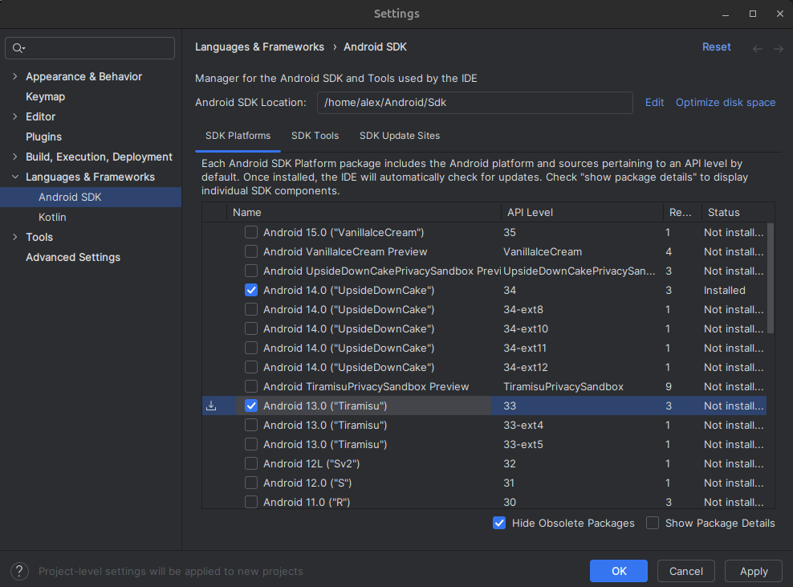
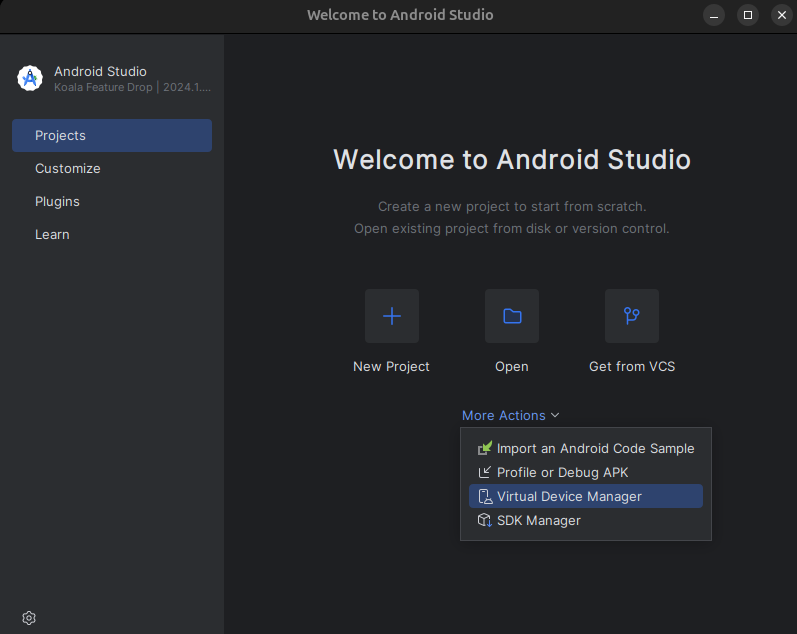
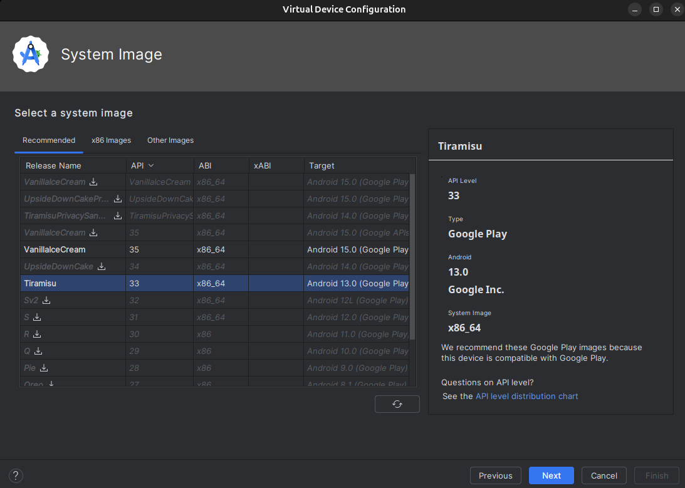

# Cheat Sheet pour le Debugging d'Apps APK

## Interception du traffic

### Prérequis :
1. Installer [Android Studio](https://developer.android.com/studio/install).
2. Installer [adb](https://www.xda-developers.com/install-adb-windows-macos-linux/).
3. Activer [l'accélération KVM pour Linux](https://developer.android.com/r/studio-ui/emulator-kvm-setup.html) (Perso je l'ai pas fait).

### Configuration de l'émulateur :
4. Ouvrir Android Studio et installer les paramètres de base. L'installation est un peu lourde, mais bon.
5. Une fois installé, aller dans **More Actions > SDK Manager**.


6. Cocher Android 13 dans les options disponibles.



7. Ensuite, aller dans **More Actions > Virtual Device Manager**.



8. Sélectionner un **Pixel 6** (sans le logo du Play Store, important) et télécharger l’image **Tiramisu** avec Android 13.



9. Lancer l’émulateur une première fois pour charger tous les fichiers nécessaires. Ensuite, il faut le démarrer en ligne de commande avec :

```bash
cd ~/Android/Sdk/emulator
./emulator -avd pixel -writable-system  # Remplacer 'pixel' par le nom de l'émulateur
```

### Intégration du certificat Burp :
10. Dans Burp Suite, récupérer le certificat :
   - Aller dans **Proxy > Proxy settings > Proxy listeners > Import / Export CA certificate**.
   - Exporter le certificat au format DER.

11. Convertir le certificat pour l’intégrer dans Android :

```bash
openssl x509 -inform DER -in burp.der -out burp_cacert.pem
CERTHASHNAME="$(openssl x509 -inform PEM -subject_hash_old -in burp_cacert.pem | head -1).0"
mv burp_cacert.pem $CERTHASHNAME
```

12. Pousser le certificat dans l’émulateur et installer-le :

```bash
adb root
adb remount
adb push $CERTHASHNAME /sdcard/
adb shell mv /sdcard/$CERTHASHNAME /system/etc/security/cacerts/
adb shell chmod 644 /system/etc/security/cacerts/$CERTHASHNAME
adb reboot
```

13. Le certificat doit maintenant être visible dans :
   **Settings > Security > More security settings > Encryption and credentials > Trusted credentials**.

14. Dans les options en haut à droite de l'émulateur ... > Settings > Proxy et remplir les options

15. C’est prêt glhf 🎉

 ## Reverse d'une app